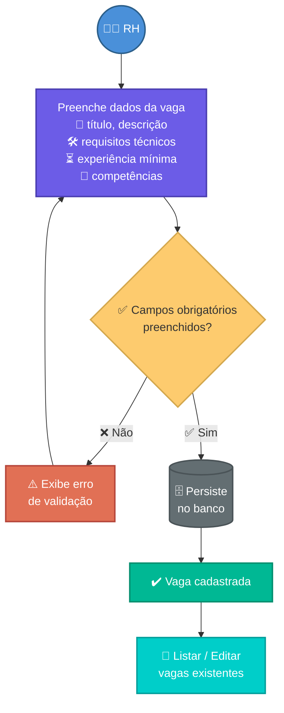
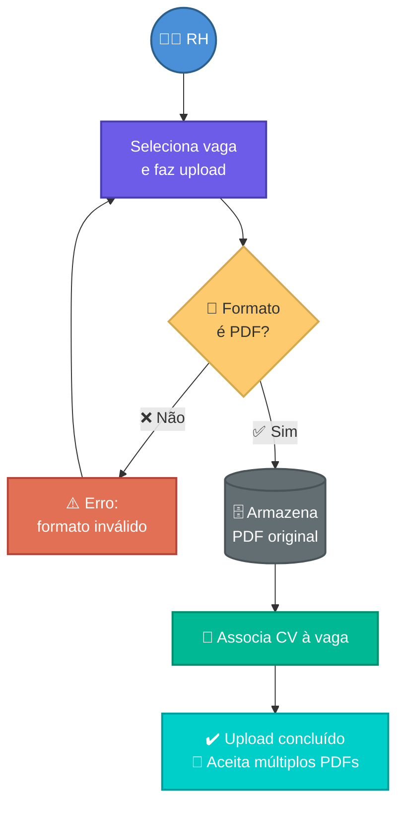
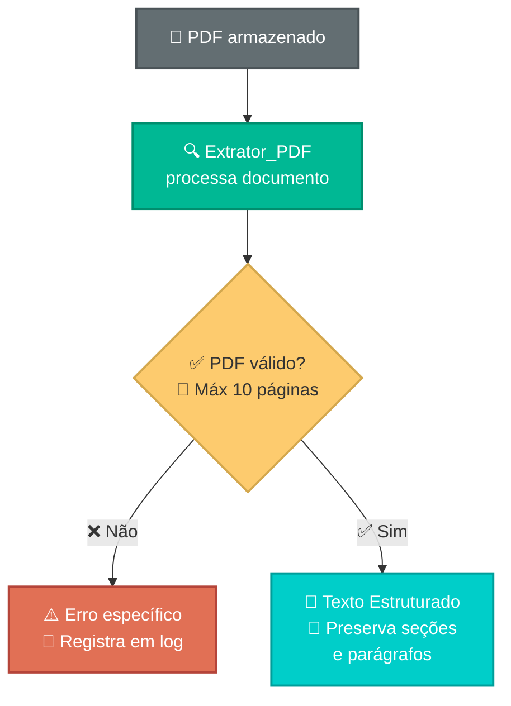
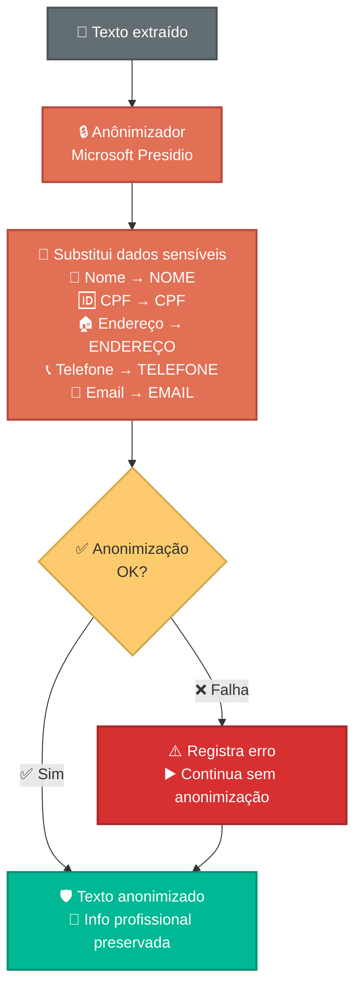
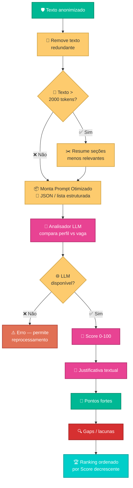
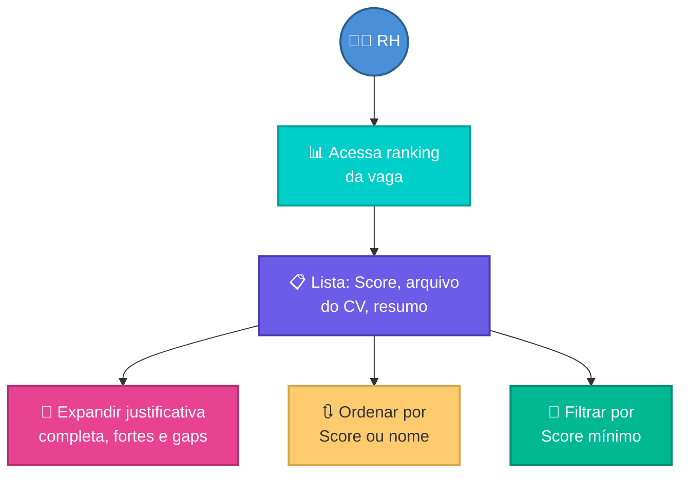

# ConectaTalentos

## 📄 RH Inteligente — Ranqueamento de Currículos com IA

> Projeto do **Grupo 4** do curso **IA para Desenvolvedores**

---

## 🎯 Objetivo

Ranquear candidatos e facilitar a decisão do RH na escolha do profissional mais adequado para cada vaga.

--- 

## ⚙️ Como Funciona

1. **Cadastro de Vagas** — O RH registra as oportunidades disponíveis.
2. **Upload de Currículo** — O RH cadastra os currículos recebidos.
3. **Extração** — Conversão de PDF para texto estruturado.
4. **Análise por LLM** — A IA compara o perfil do candidato e ranqueia os mais adequados para cada vaga.

---

## 🚀 Desafios

- Criar o melhor prompt para ler currículos, pontuar e adequar o melhor candidato para a vaga.
- Otimizar para usar a menor quantidade de tokens possíveis mantendo a eficiência da análise.

---

## 🛠️ Tecnologias

| Tecnologia | Uso |
|---|---|
| Python (Web App) | Backend e interface web |
| Extração PDF nativa | Conversão de currículo para texto |
| LLM otimizado | Análise e ranqueamento de candidatos |
| Microsoft Presidio | Anonimização de dados sensíveis (LGPD) |

---

## 🚀 Como Executar o Projeto

### Pré-requisitos

- Python 3.11 ou superior
- pip (gerenciador de pacotes Python)

### 1. Clonar o Repositório

```bash
git clone <url-do-repositorio>
cd Conecta-Talentos
```

### 2. Criar Ambiente Virtual

**Linux/Mac:**
```bash
python -m venv .venv
source .venv/bin/activate
```

**Windows:**
```bash
python -m venv .venv
.venv\Scripts\activate
```

### 3. Instalar Dependências

```bash
pip install -r backend/requirements-basico.txt
```

Ou instalar manualmente:
```bash
pip install pymupdf
```

### 4. Testar a Classe ExtratorPDF

**Executar exemplos completos:**
```bash
python backend/src/exemplo_uso_extrator.py
```

**Testar com arquivo de exemplo:**
```bash
# Exibir no terminal
python backend/src/extrator_pdf.py backend/exemplo.pdf

# Salvar em arquivo
python backend/src/extrator_pdf.py backend/exemplo.pdf saida.txt
```

**Usar a classe no código:**
```python
from pathlib import Path
from backend.src.extrator_pdf import ExtratorPDF

# Criar extrator
extrator = ExtratorPDF(max_paginas=10)

# Extrair texto
resultado = extrator.extrair_texto(Path("backend/exemplo.pdf"))

# Usar resultado
print(f"Páginas: {resultado.num_paginas}")
print(f"Texto: {resultado.conteudo}")
```

### 5. Estrutura do Projeto

```
Conecta-Talentos/
├── .kiro/                           # Especificações do Kiro/IA
├── .github/                         # Configurações para Github
├── backend/                         # Backend Python
│   ├── docs/                        # Documentação
│   │   ├── base-implementacao.md
│   │   ├── classe-extrator-pdf.md
│   │   └── como-usar-extrator.md
│   ├── tests/                       # Testes automatizados
│   ├── src/                         # Código-fonte
│   │   ├── extrator_pdf.py
│   │   ├── exemplo_uso_extrator.py
│   │   └── pdf_to_text.py
│   ├── .env.example                 # Variáveis de ambiente
│   ├── exemplo.pdf                  # Arquivo de teste
│   └── requirements-basico.txt      # Dependências Python
├── scripts/                         # Scripts gerais do repositório
├── .gitignore
└── README.md
```

---

## 📚 Documentação

- **[Guia de Uso](backend/docs/como-usar-extrator.md)** - Como usar a classe ExtratorPDF
- **[Documentação Técnica](backend/docs/classe-extrator-pdf.md)** - Arquitetura e detalhes da implementação
- **[Base de Implementação](backend/docs/base-implementacao.md)** - Guia completo para implementar o sistema
- **[Requisitos](/.kiro/specs/conecta-talentos/requirements.md)** - Requisitos funcionais do sistema
- **[Design](/.kiro/specs/conecta-talentos/design.md)** - Arquitetura e design técnico

---

## 📄 Conversão de PDF para Texto

### Script Legado (pdf_to_text.py)

Script utilitário original para extrair texto de arquivos PDF.

```bash
# Exibir o texto no terminal
python backend/src/pdf_to_text.py backend/exemplo.pdf

# Salvar o texto em um arquivo
python backend/src/pdf_to_text.py backend/exemplo.pdf saida.txt
```

### Nova Classe ExtratorPDF (Recomendado)

Classe profissional com validação, tratamento de erros e documentação completa.

```bash
# Executar exemplos
python backend/src/exemplo_uso_extrator.py

# Usar diretamente
python backend/src/extrator_pdf.py backend/exemplo.pdf
```

---

## 🧪 Testes

Para testar a classe ExtratorPDF:

```bash
# Executar todos os exemplos
python backend/src/exemplo_uso_extrator.py

# Testar com arquivo específico
python backend/src/extrator_pdf.py seu_arquivo.pdf
```

---

## 🔧 Solução de Problemas

### Erro: "ModuleNotFoundError: No module named 'pymupdf'"

**Solução:**
```bash
pip install pymupdf
```

### Erro: "Arquivo não encontrado"

**Solução:** Verifique se o arquivo PDF existe no diretório atual ou forneça o caminho completo.

### Erro: "PDF tem X páginas, máximo permitido: Y"

**Solução:** Aumente o limite de páginas ao criar o extrator:
```python
extrator = ExtratorPDF(max_paginas=20)
```

---

## 📈 Roadmap

- [x] Classe ExtratorPDF implementada
- [x] Documentação completa
- [x] Especificações (requirements e design)
- [ ] Classe Anonimizador (Microsoft Presidio)
- [ ] Classe AnalisadorLLM (OpenAI)
- [ ] Interface Web (FastAPI)
- [ ] Testes automatizados
- [ ] Deploy em produção

---

## 👥 Integrantes — Grupo 4

| Nome |
|---|
| Gustavo da Rosa Heidemann |
| Halan Germano Bacca |
| Ismael Lunkes Pereira |
| Leandro da Silva Gerolim |
| Mariana Cristina da Silva Gabriel |
| Pedro Santos da Mota |

---

## 📊 Diagrama UML — Fluxos do Sistema


### 🔄 Pipeline Principal

Visão geral do fluxo completo do sistema, do cadastro à decisão do RH:

```mermaid
flowchart LR
    A(("🧑‍💼\nRH"))
    B["📋 Cadastro\nde Vaga"]
    C["📄 Upload\nde CVs"]
    D["🔍 Extração\nde Texto"]
    E["🔒 Anonimização\nLGPD"]
    F["⚡ Otimização\nde Tokens"]
    G["🤖 Análise\nLLM"]
    H[("🗄️\nBanco")]
    I["🏆 Ranking\nFinal"]

    A --> B --> C --> D --> E --> F --> G --> H --> I --> A

    style A fill:#4A90D9,stroke:#2C5F8A,color:#fff,stroke-width:2px
    style B fill:#6C5CE7,stroke:#4A3DB0,color:#fff,stroke-width:2px
    style C fill:#6C5CE7,stroke:#4A3DB0,color:#fff,stroke-width:2px
    style D fill:#00B894,stroke:#008E6E,color:#fff,stroke-width:2px
    style E fill:#E17055,stroke:#B5453A,color:#fff,stroke-width:2px
    style F fill:#FDCB6E,stroke:#D4A84E,color:#333,stroke-width:2px
    style G fill:#E84393,stroke:#B5306F,color:#fff,stroke-width:2px
    style H fill:#636E72,stroke:#4A5357,color:#fff,stroke-width:2px
    style I fill:#00CEC9,stroke:#009E9A,color:#fff,stroke-width:2px
```



### 📋 Req 1 — Cadastro de Vagas



### 📄 Req 2 — Upload de Currículos



### 🔍 Req 3 — Extração de Texto



### 🔒 Req 4 — Anonimização LGPD



### ⚡ Req 5 e 6 — Otimização de Tokens + Análise LLM



### 🏆 Req 7 — Visualização de Resultados



### 🌐 Req 8 — Interface Web + 🗄️ Req 9 — Persistência + ⚠️ Req 10 — Erros

```mermaid
flowchart LR
    subgraph WEB["🌐 Interface Web"]
        W1["🖥️ Responsivo desktop"]
        W2["📑 Páginas:\nVagas · Upload · Rankings"]
        W3["⏳ Feedback visual:\nloading · progresso"]
    end

    subgraph DB["🗄️ Persistência"]
        D1["💾 Vagas cadastradas"]
        D2["📄 PDFs armazenados"]
        D3["📊 Scores e rankings"]
        D4["🔄 Recuperação pós-restart"]
        D5["🗑️ Exclusão em cascata"]
    end

    subgraph ERR["⚠️ Tratamento de Erros"]
        E1["📄 Falha no Extrator → msg PDF"]
        E2["🔒 Falha Anônimizador → continua"]
        E3["🤖 Falha LLM → reprocessar"]
        E4["📎 Falha upload → msg erro"]
        E5["📝 Log de todos os erros"]
    end

    WEB --> DB
    WEB --> ERR

    style W1 fill:#4A90D9,stroke:#2C5F8A,color:#fff,stroke-width:2px
    style W2 fill:#4A90D9,stroke:#2C5F8A,color:#fff,stroke-width:2px
    style W3 fill:#4A90D9,stroke:#2C5F8A,color:#fff,stroke-width:2px
    style D1 fill:#636E72,stroke:#4A5357,color:#fff,stroke-width:2px
    style D2 fill:#636E72,stroke:#4A5357,color:#fff,stroke-width:2px
    style D3 fill:#636E72,stroke:#4A5357,color:#fff,stroke-width:2px
    style D4 fill:#636E72,stroke:#4A5357,color:#fff,stroke-width:2px
    style D5 fill:#636E72,stroke:#4A5357,color:#fff,stroke-width:2px
    style E1 fill:#E17055,stroke:#B5453A,color:#fff,stroke-width:2px
    style E2 fill:#E17055,stroke:#B5453A,color:#fff,stroke-width:2px
    style E3 fill:#E17055,stroke:#B5453A,color:#fff,stroke-width:2px
    style E4 fill:#E17055,stroke:#B5453A,color:#fff,stroke-width:2px
    style E5 fill:#E17055,stroke:#B5453A,color:#fff,stroke-width:2px
```



---

## 📝 Licença

Projeto acadêmico — uso educacional.
