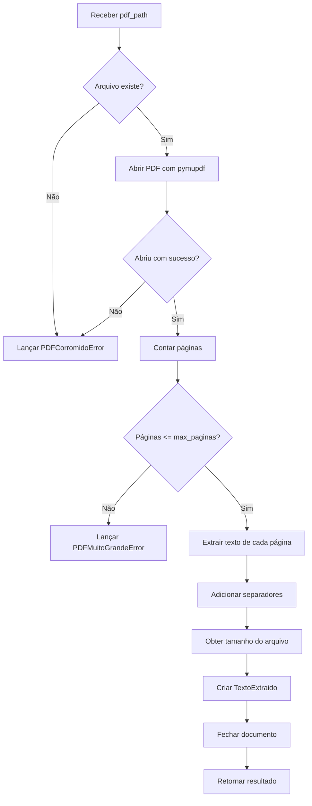

# Classe ExtratorPDF - Documentação

## Visão Geral

A classe `ExtratorPDF` é o primeiro componente do pipeline de processamento do ConectaTalentos. Ela é responsável por converter documentos PDF de currículos em texto estruturado que pode ser processado pelos componentes subsequentes (Anonimizador e Analisador LLM).

## Localização

- **Arquivo**: `extrator_pdf.py`
- **Módulo**: `extrator_pdf`
- **Pacote**: Raiz do projeto (será movido para `app/processors/` na estrutura final)

## Arquitetura

### Diagrama de Classes

```
┌─────────────────────────────────────┐
│         ExtratorPDF                 │
├─────────────────────────────────────┤
│ - max_paginas: int                  │
├─────────────────────────────────────┤
│ + __init__(max_paginas: int)        │
│ + extrair_texto(pdf_path: Path)     │
│ + validar_pdf(pdf_path: Path)       │
│ - _extrair_texto_estruturado(doc)   │
└─────────────────────────────────────┘
           │
           │ retorna
           ▼
┌─────────────────────────────────────┐
│       TextoExtraido                 │
├─────────────────────────────────────┤
│ + conteudo: str                     │
│ + num_paginas: int                  │
│ + tamanho_bytes: int                │
│ + sucesso: bool                     │
└─────────────────────────────────────┘

           │
           │ pode lançar
           ▼
┌─────────────────────────────────────┐
│         PDFError                    │
│    (Exception base)                 │
├─────────────────────────────────────┤
│  ├─ PDFCorromidoError               │
│  └─ PDFMuitoGrandeError             │
└─────────────────────────────────────┘
```

## Componentes

### 1. Classe Principal: `ExtratorPDF`

Responsável pela extração de texto de arquivos PDF.

#### Atributos

- `max_paginas` (int): Número máximo de páginas permitido (padrão: 10)

#### Métodos Públicos

##### `__init__(max_paginas: int = 10)`

Inicializa o extrator com limite de páginas configurável.

**Parâmetros:**
- `max_paginas`: Limite de páginas para processamento

**Exemplo:**
```python
extrator = ExtratorPDF(max_paginas=10)
```

##### `extrair_texto(pdf_path: Path) -> TextoExtraido`

Extrai texto de um arquivo PDF.

**Parâmetros:**
- `pdf_path`: Caminho para o arquivo PDF (objeto Path)

**Retorna:**
- `TextoExtraido`: Objeto contendo texto extraído e metadados

**Exceções:**
- `PDFCorromidoError`: PDF não pode ser aberto ou está corrompido
- `PDFMuitoGrandeError`: PDF excede o limite de páginas

**Exemplo:**
```python
from pathlib import Path
from extrator_pdf import ExtratorPDF

extrator = ExtratorPDF()
resultado = extrator.extrair_texto(Path("curriculo.pdf"))
print(resultado.conteudo)
```

##### `validar_pdf(pdf_path: Path) -> tuple[bool, Optional[str]]`

Valida se um PDF pode ser processado sem lançar exceções.

**Parâmetros:**
- `pdf_path`: Caminho para o arquivo PDF

**Retorna:**
- Tupla `(válido, mensagem_erro)`
  - `válido`: True se pode ser processado
  - `mensagem_erro`: Descrição do erro ou None

**Exemplo:**
```python
valido, erro = extrator.validar_pdf(Path("teste.pdf"))
if not valido:
    print(f"Erro: {erro}")
```

#### Métodos Privados

##### `_extrair_texto_estruturado(doc: pymupdf.Document) -> str`

Extrai texto preservando a estrutura do documento (separadores de página).

### 2. Dataclass: `TextoExtraido`

Encapsula o resultado da extração.

#### Atributos

- `conteudo` (str): Texto completo extraído
- `num_paginas` (int): Número de páginas do documento
- `tamanho_bytes` (int): Tamanho do arquivo em bytes
- `sucesso` (bool): Indica sucesso da operação (padrão: True)

**Exemplo:**
```python
@dataclass
class TextoExtraido:
    conteudo: str
    num_paginas: int
    tamanho_bytes: int
    sucesso: bool = True
```

### 3. Hierarquia de Exceções

#### `PDFError` (Exception base)

Exceção base para todos os erros relacionados a PDF.

#### `PDFCorromidoError` (herda de PDFError)

Lançada quando:
- Arquivo não existe
- PDF não pode ser aberto
- PDF está corrompido ou ilegível

#### `PDFMuitoGrandeError` (herda de PDFError)

Lançada quando o PDF excede o limite de páginas configurado.

## Fluxo de Processamento



## Integração no Pipeline ConectaTalentos

A classe `ExtratorPDF` é o primeiro componente do pipeline:

```
PDF → [ExtratorPDF] → Texto → [Anonimizador] → Texto Anonimizado → [Analisador LLM] → Score
```

### Exemplo de Integração

```python
from pathlib import Path
from extrator_pdf import ExtratorPDF

# Passo 1: Extrair texto
extrator = ExtratorPDF(max_paginas=10)
resultado = extrator.extrair_texto(Path("curriculo.pdf"))

# Passo 2: Passar para próximo componente
texto_para_anonimizar = resultado.conteudo

# Passo 3: Continuar pipeline...
# anonimizador.anonimizar(texto_para_anonimizar)
```

## Requisitos Atendidos

A classe `ExtratorPDF` atende ao **Requisito 3** do documento de requisitos:

### Requisito 3: Extração de Texto de Currículos

✅ **AC1**: Converte PDF em Texto_Estruturado  
✅ **AC2**: Preserva estrutura lógica (separadores de página)  
✅ **AC3**: Extrai texto de todas as páginas  
✅ **AC4**: Retorna erro específico para PDF corrompido  
✅ **AC5**: Processa PDFs com até 10 páginas  

## Testes

### Testes Unitários

```python
import pytest
from pathlib import Path
from extrator_pdf import ExtratorPDF, PDFCorromidoError, PDFMuitoGrandeError

def test_extrair_texto_sucesso():
    extrator = ExtratorPDF()
    resultado = extrator.extrair_texto(Path("exemplo.pdf"))
    assert resultado.sucesso
    assert len(resultado.conteudo) > 0
    assert resultado.num_paginas > 0

def test_pdf_inexistente():
    extrator = ExtratorPDF()
    with pytest.raises(PDFCorromidoError):
        extrator.extrair_texto(Path("nao_existe.pdf"))

def test_pdf_muito_grande():
    extrator = ExtratorPDF(max_paginas=1)
    with pytest.raises(PDFMuitoGrandeError):
        extrator.extrair_texto(Path("pdf_com_muitas_paginas.pdf"))
```

### Property-Based Testing

```python
from hypothesis import given, strategies as st

@given(st.integers(min_value=1, max_value=100))
def test_max_paginas_configuravel(max_paginas):
    extrator = ExtratorPDF(max_paginas=max_paginas)
    assert extrator.max_paginas == max_paginas
```

## Dependências

- **pymupdf** (4.23.21+): Biblioteca para manipulação de PDFs
- **Python** 3.11+: Suporte a type hints modernos

### Instalação

```bash
pip install pymupdf
```

## Uso no Projeto

### Exemplo Completo

```python
from pathlib import Path
from extrator_pdf import ExtratorPDF, PDFError

def processar_curriculo(pdf_path: Path):
    """Processa um currículo PDF."""
    extrator = ExtratorPDF(max_paginas=10)
    
    try:
        # Validar antes de processar
        valido, erro = extrator.validar_pdf(pdf_path)
        if not valido:
            print(f"PDF inválido: {erro}")
            return None
        
        # Extrair texto
        resultado = extrator.extrair_texto(pdf_path)
        
        print(f"✓ Currículo processado:")
        print(f"  - Páginas: {resultado.num_paginas}")
        print(f"  - Tamanho: {resultado.tamanho_bytes} bytes")
        print(f"  - Caracteres: {len(resultado.conteudo)}")
        
        return resultado.conteudo
    
    except PDFError as e:
        print(f"✗ Erro ao processar: {e}")
        return None

# Usar
texto = processar_curriculo(Path("curriculo.pdf"))
if texto:
    # Continuar pipeline...
    pass
```

## Melhorias Futuras

1. **Extração de Metadados**: Extrair autor, data de criação, etc.
2. **OCR**: Suporte para PDFs escaneados (usando Tesseract)
3. **Detecção de Seções**: Identificar automaticamente seções do currículo
4. **Cache**: Cachear resultados de extração para PDFs já processados
5. **Processamento Assíncrono**: Suporte para async/await
6. **Progresso**: Callback para reportar progresso em PDFs grandes

## Referências

- [PyMuPDF Documentation](https://pymupdf.readthedocs.io/)
- [Python Dataclasses](https://docs.python.org/3/library/dataclasses.html)
- [Python Type Hints](https://docs.python.org/3/library/typing.html)

## Autores

**Grupo 4 - IA para Desenvolvedores**
- Gustavo da Rosa Heidemann
- Halan Germano Bacca
- Ismael Lunkes Pereira
- Leandro da Silva Gerolim
- Mariana Cristina da Silva Gabriel
- Pedro Santos da Mota

---

**Última atualização**: 2024  
**Versão**: 1.0.0
